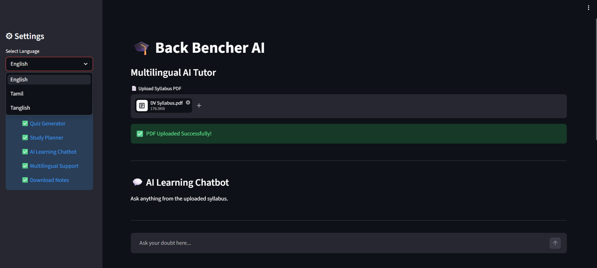
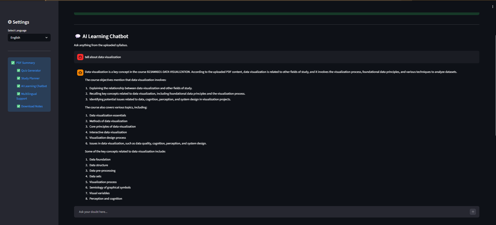
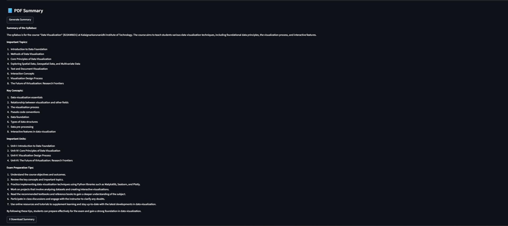

# 🎓 AI Personal Study Mentor

AI Personal Study Mentor is a multilingual AI-powered educational assistant that helps students learn interactively from uploaded syllabus PDFs. The system uses Generative AI to summarize content, answer doubts, generate quizzes, and create smart study plans.

---

## 🟢 Project Structure

```plaintext
STUDY MENTOR AI/
├── app.py                 # Main Streamlit application
├── requirements.txt       # Python dependencies
├── .env                   # Environment configuration
├── .gitignore             # Git ignore rules
├── README.md              # Project documentation
└── assets/                # Screenshots and images


```
## 🟢System Workflow
```
User Uploads PDF
        ↓
PDF Text Extraction
        ↓
Groq LLM Processing
        ↓
Summary / Quiz / Study Plan
        ↓
AI Chatbot Interaction
        ↓
Download Generated Content

```
## 🟢 Features & Advantages
AI Learning Chatbot

🏴 Interactive chatbot for doubt clarification
🏴 Context-aware educational responses
🏴 Answers based on uploaded syllabus

Multilingual Support

🏴 English Support
🏴 Tamil Support
🏴 Tanglish Support

AI-Powered Learning Tools

🏴 PDF Summarization
🏴 Quiz Generation
🏴 Smart Study Planner

Downloadable Content

🏴 Download summaries
🏴 Download quizzes
🏴 Download study plans
🏴 Download chatbot conversations
## 🟢 Technologies & Tools
AI & Backend

🏴 Groq API (Llama 3)
🏴 Python
🏴 Streamlit
🏴 PyMuPDF

Deployment

🏴 GitHub
🏴 Render Cloud Platform

## 🟢 Project Screenshots

### 🏠 Home Page


### 💬 AI Chatbot


### 📘 PDF Summary


### 🧠 Quiz Generator

